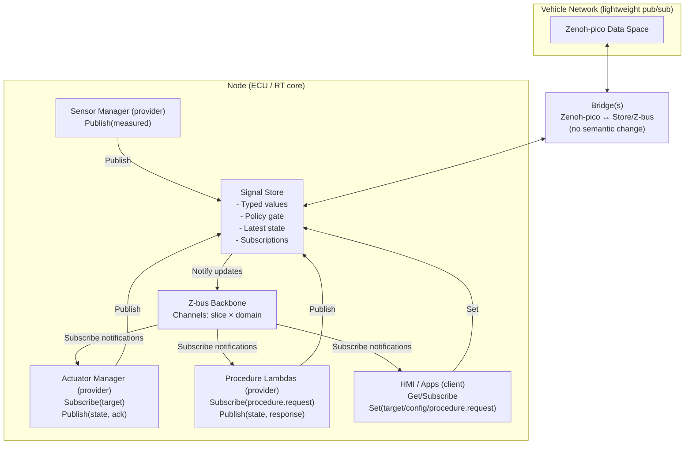

# VehicleOS-RT: Architecture and Approach (Zephyr + Z-bus + Zenoh-pico + VSS-as-API)

**Purpose:** Define the VehicleOS-RT architecture, primitives, contracts, and scalability philosophy for a real-time, certifiable-by-construction platform that uses **COVESA VSS semantics as the API contract**, **Z-bus** as the deterministic in-node backbone, and **Zenoh-pico** as the lightweight inter-node transport with a **semantic-preserving gateway**.

This document is intended to be the **primary reference architecture** for a black repo.

---

## 1. Non-goals (to keep the architecture crisp)

- Not attempting full safety certification in the MVP; we design the **core primitives** to be certifiable, and keep feature logic in lambdas.
- Not implementing heavy in-vehicle RPC stacks (e.g., SOME/IP) as core transport.
- Not modeling high-bandwidth perception data as VSS leaves (Level 3+ perception payloads are treated as **streams**, with derived states published into VSS).

---

## 2. Core philosophy

### 2.1 VSS-as-API (semantic contract)
- **Canonical contract = VSS path + VSS type.**
- All application interactions are expressed as:
  - **Get(path)**
  - **Set(path, value)**
  - **Publish(path, value, meta)**
  - **Subscribe(path-filter, mode)**

> “Publish” is provider-only (authoritative source); “Set” is client-only (requesting change to target/config/procedure request).

### 2.2 Provider vs client clarity (no ambiguity)
We remove ambiguity by enforcing both:
1) **Signal semantics (measured vs target vs state vs config vs procedure)**, and
2) **Role-based verbs (Publish vs Set)**.

Example:
- Sensor/provider publishes measured value:
  - `Publish("Vehicle.Cabin.HVAC.CabinTemperature", 24.6)`
- HMI/client requests desired temperature:
  - `Set("Vehicle.Cabin.HVAC.TargetTemperature", 22.0)`

### 2.3 Procedures for orchestration (no “command” vocabulary)
Composite orchestration is modeled as **Procedures**, represented by request/state/response signals:
- `Set("Vehicle.Cabin.Precondition.Request", {...})`
- `Subscribe("Vehicle.Cabin.Precondition.State")`
- `Subscribe("Vehicle.Cabin.Precondition.Response")`

---

## 3. Primitive vocabulary (Linux-friendly)

- **Signal**: typed state at a path (VSS node/leaf).
- **Procedure**: asynchronous workflow orchestrator, expressed with request/state/response signals.
- **Store**: the Signal Store (typed latest-value database + policy gate).
- **Backbone**: Z-bus channels used for deterministic notifications inside a node.
- **Bridge**: Zenoh-pico ↔ Z-bus/Store gateway with **no semantic change**.
- **Capability**: permission set for lambdas (publish/set/subscribe on specific paths).
- **Slice**: bus partition category: `safety`, `control`, `data`, `diag`.

---

## 4. Signal classes and rules

### 4.1 Signal classes (schema-enforced)
Each signal is classified in schema, driving permissions, routing, and lifecycle.

| Class | Meaning | Writer verb | Typical writers (providers) | Typical readers (clients) |
|---|---|---:|---|---|
| `measured` | observed physical state | `Publish` | sensor manager / driver adapter | HMI, controllers, procedures |
| `target` | desired value request | `Set` | HMI, procedures | actuator controller |
| `state` | applied/actual actuator state | `Publish` | actuator controller | HMI, procedures |
| `config` | tunable parameter | `Set` | HMI, procedures, calibration tools | controllers |
| `procedure.request` | start/modify workflow | `Set` | HMI, procedures | procedure lambda |
| `procedure.state` | workflow progress/state | `Publish` | procedure lambda | HMI, others |
| `procedure.response` | workflow completion/response | `Publish` | procedure lambda | HMI, others |
| `ack` | acknowledgement for `target`/`config` | `Publish` | relevant controller | requester |

> Decision: **Ack is required** for `target` writes (and recommended for `config` and `procedure.request`).

### 4.2 Ack pattern (required)
For every `target` signal:
- `...TargetX` (client `Set`)
- `...TargetX.Ack` (controller `Publish`) — accepted/rejected + reason + applied value (optional)
- `...TargetX.State` (controller `Publish`) — applied state, faults, mode

---

## 5. Architecture overview

### 5.1 Components
- **Signal Store**: typed latest-value store, policy gate, subscription registry.
- **Z-bus Backbone**: deterministic notification channels (per slice + domain).
- **Zenoh-pico Bridge(s)**: semantic-preserving gateway between Zenoh and Store/Z-bus.
- **Providers**:
  - Sensor Manager (publishes `measured`)
  - Actuator Manager/Controller (consumes `target`, publishes `state` + `ack`)
- **Procedure lambdas**: orchestration workflows expressed via request/state/response signals.
- **Clients**: HMI, diagnostics, higher-level apps (read via Get/Subscribe; write via Set on allowed targets/config/procedures).

### 5.2 Logical diagram



---

## 6. Signal Store design (certifiable core)

### 6.1 Responsibilities
- Own authoritative latest value for all supported VSS paths within this build/variant.
- Enforce:
  - typing (VSS types)
  - bounds/units rules (schema constraints)
  - role-based permissions (Publish vs Set)
  - provider ownership (only designated provider can Publish measured/state/ack)
- Emit deterministic notifications into Z-bus channels based on slicing rules.

### 6.2 Data representation
The Store is generated from domain packages at build time:

- **Signal registry** (compile-time)
  - `path` (canonical VSS path string for tooling/gateway)
  - `type` (VSS type)
  - `class` (`measured/target/...`)
  - `slice` (`safety/control/data/diag`)
  - `domain` (`cabin/body/powertrain/...`)
  - constraints: min/max, unit, min_period, eps
  - ownership: provider IDs
  - ACL: which lambdas/clients can `Set/Publish/Subscribe`

- **Runtime state**
  - latest value (typed union)
  - timestamps (monotonic + optional wall clock)
  - sequence number
  - validity/confidence flags
  - last publisher id

> Implementation note: internal lookup uses generated IDs/handles for speed, but **external contract stays VSS path + VSS type**.

### 6.3 Notification emission (store → z-bus)
- Store emits `vss_update_t` notifications (path handle + type + metadata + optional inline value).
- Consumers can:
  - process inline value (small types), or
  - pull the latest from Store using `Get()` for hot signals.

---

## 7. Z-bus backbone (deterministic notifications)

### 7.1 Slicing: separate channel per slice × domain (intended target)
**Primary slicing:** function/criticality
- `safety`, `control`, `data`, `diag`

**Secondary slicing:** domain
- `cabin`, `body`, `powertrain`, `chassis` (extend later)

**Result:** channels like:
- `safety.cabin`, `control.cabin`, `data.cabin`, `diag.cabin`
- `safety.powertrain`, ...

This enables:
- different queue depths, priorities, and drop/coalesce policies per slice
- easier certification partitioning
- predictable resource accounting

### 7.2 Subscribe modality on Z-bus
Subscribers register interest through the Store’s `Subscribe()` API, which:
- installs a filter (path prefix / exact path / signal class / slice)
- binds subscriber to one or more Z-bus channels
- delivers notifications with chosen mode:
  - `on_change` (edge-trigger)
  - `periodic_latest` (pull-based periodic read + minimal notify)
  - `coalesced` (latest wins within a window)

### 7.3 Hot signals (Ignition, Gear, etc.)
Default behavior:
- Z-bus notification is **notify-only** (no heavy payload replication).
- Subscribers **pull latest from Store** on notify.
- Store may coalesce redundant updates.

---

## 8. Zenoh-pico interface and gateway

### 8.1 External key format (confirmed)
Canonical Zenoh key expression:
- `vss.Vehicle.Cabin.HVAC.TargetTemperature`

Rules:
- prefix `vss.`
- dot delimiter aligns with internal canonical paths
- gateway maps key ↔ internal registry entry

### 8.2 “No semantic change” bridge
Gateway performs only:
- key ↔ path mapping
- framing/serialization (e.g., FlatBuffers if chosen)
- publish/subscribe bridging

It must not:
- interpret semantics
- apply policies
- execute orchestration
- compute derived values

### 8.3 Scale and no-choke design
- **Shard by slice × domain**:
  - one bridge instance per slice × domain (or at least per domain)
- enforce backpressure:
  - bounded queues
  - coalescing allowed for `data/diag`, not allowed for `safety/control` acknowledgements
- keep it deterministic and minimal for certification feasibility.

---

## 9. Team scalability and repo organization

### 9.1 Domain packages (not per leaf)
We keep:
- folder per domain package
- domain files describing signals/constraints/ownership/ACL
- codegen generates store tables and routing

Example:
```
domains/
  cabin/
    signals/
      package.yaml
      vss.yaml
      constraints.yaml
    lambdas/
      cabin_precondition/
      hvac_controller/
  body/
    signals/...
    lambdas/...
  powertrain/
    signals/...
    lambdas/...
```

### 9.2 CI/CD principles
- Domain teams modify only their package + lambdas.
- Central pipeline:
  - validates schema + constraints
  - generates store/bus bindings
  - builds per-variant images
  - runs integration tests in QEMU/container
- OTA:
  - lambdas can be updated more frequently than core store/backbone
  - schema evolution follows strict versioning (below)

---

## 10. Versioning and compatibility (OTA-friendly)

### 10.1 Version packages, not individual signals
- `domains/<domain>/signals/package.yaml` contains semantic version.
- VSS paths are stable identifiers.

### 10.2 Compatibility rules
- **Minor version (additive)**:
  - add new signals
  - add new optional fields for procedure requests (with defaults)
  - add new enum values (only if old clients handle unknown)
- **Major version (breaking)**:
  - type change
  - meaning change
  - removal
  - unit semantics change

Breaking changes require adding a **new path**, not mutating old:
- `...TargetTemperatureV2` (or new sub-node)

### 10.3 Deprecation policy
- mark deprecated
- keep for N releases
- optionally ship bridge lambda for old→new mapping

---

## 11. Security, observability, and platform services

### 11.1 Platform services (core)
- logging (structured)
- metrics (per-lambda queues, drops, exec time)
- tracing (correlation across procedures + gateway)
- policy enforcement (capabilities + ownership)
- health monitoring (heartbeats + watchdog hooks)

### 11.2 Lambda SDK
Expose stable SDK headers to lambdas:
- `vo_get(path_handle)`
- `vo_set(path_handle, value)`
- `vo_publish(path_handle, value, meta)`
- `vo_subscribe(filter, mode, cb)`
- `vo_log(...)`, `vo_metric_inc(...)`, `vo_fault_raise(...)`

---

## 12. What gets certified first (future path)
To keep certification feasible:
- certify the **core**: Store + policy + Z-bus binding + gateway minimal bridge
- keep feature logic (lambdas, procedures) as controlled components with stricter rules as safety class increases.

---

## Appendix A: Minimal signal examples

### Cabin
- `Vehicle.Cabin.HVAC.CabinTemperature` (`measured`, `data`)
- `Vehicle.Cabin.HVAC.TargetTemperature` (`target`, `control`)
- `Vehicle.Cabin.HVAC.TargetTemperature.Ack` (`ack`, `control`)
- `Vehicle.Cabin.Precondition.Request` (`procedure.request`, `control`)
- `Vehicle.Cabin.Precondition.State` (`procedure.state`, `control`)
- `Vehicle.Cabin.Precondition.Response` (`procedure.response`, `control`)

### Body / Door
- `Vehicle.Body.Door.FrontLeft.IsOpen` (`measured`, `data`)
- `Vehicle.Body.Door.FrontLeft.LockTarget` (`target`, `control`)
- `Vehicle.Body.Door.FrontLeft.LockTarget.Ack` (`ack`, `control`)
